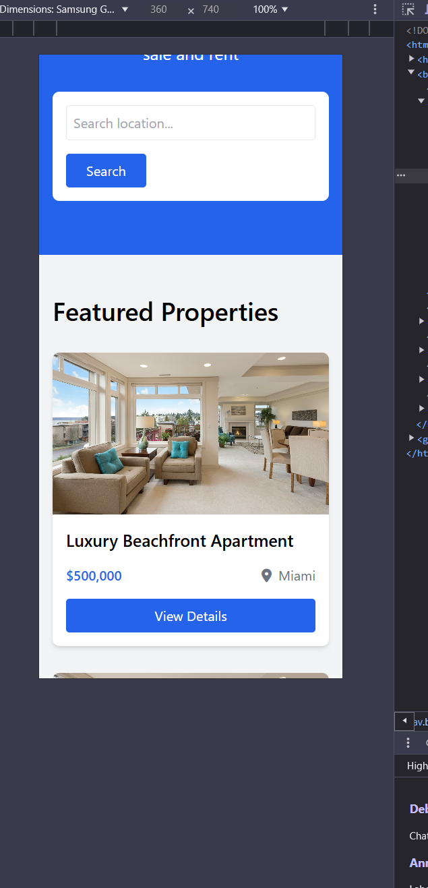

## Introduction
This repository contains the code and resources for a Properties Listing application built using the Node.js, JavaScipt, Tailwind CSS & EJS Template Library</br> The project aims to provide users with a seamless platform to browse, list, and manage real estate properties efficiently.

## Technology Stack
- **MongoDB**: NoSQL database for storing property listings and user information.
- **Express**: Web framework for Node.js to build RESTful APIs.
- **EJS**: EJS (Embedded JavaScript) is a templating engine for generating dynamic HTML on the server. It embeds JavaScript directly into templates, enabling the creation of reusable and data-driven web pages efficiently.
- **Node.js**: JavaScript runtime for the backend server.


### Installation
Install dependencies
npm install

Starting the application
node app.js

### Features
• User authentication and authorization (JWT) <br/>
• Property listing and management <br/>
• Responsive design for mobile and desktop <br/>
• Smart recommendations and suggestions powered by AI <br/>

### Screeshots

Home Page


### Recommendation System Logic


This module implements a recommendation system for properties based on a user's viewing history, favorites, and preferences. Below is an overview of the logic:

### Key Steps

1. **Fetch User Data**
   - Retrieve user information, including their viewing history (`history`) and liked properties (`favorites`).
   - If the user is not found, return a 404 error.

2. **Fetch Properties**
   - Retrieve all properties from the database.

3. **Check User Activity**
   - If the user has no history or favorites, return a message prompting them to view or like properties.

4. **Generate Feature Vectors**
   - Create a list of all unique tags across all properties.
   - Convert each property's tags into a binary vector based on the presence of tags.

5. **Calculate User Preference Vector**
   - Combine the tags of the user's viewed and liked properties.
   - Compute an average feature vector to represent the user's preferences.

6. **Filter Properties**
   - Filter properties based on the user's explicit preferences (e.g., location, budget range, number of bedrooms).

7. **Calculate Similarity Scores**
   - For each filtered property:
     - Convert its tags into a feature vector.
     - Calculate its similarity to the user's preference vector using the cosine similarity metric.
   - Sort properties by similarity scores in descending order.

8. **Return Recommendations**
   - Return the list of recommended properties sorted by similarity.

### Helper Function

- **`getFeatureVector(tags, allTags)`**
  - Converts a list of tags into a binary vector based on the presence of tags in a master list of all unique tags.

### Error Handling

- Proper error responses for:
  - User not found.
  - Internal server errors during the recommendation generation process.

### Dependencies

- `User` and `Property` models for database interaction.
- `cosine-similarity` package for calculating similarity between vectors.


### Login Page


### SignUp Page


### 404 Page


### Responsive



### Propeties in MongoDB


# Property App API Documentation

## Overview
This API is designed to manage properties and recommendations, handle user authentication, and serve dynamic web pages for a property listing application.

### Base URL
```
http://<your-server-domain>:<port>
```

### Port
Default: `5000`

---

## API Endpoints

### Authentication Routes
**Base Path:** `/api/auth`

Refer to the `authRoutes.js` file for detailed routes and functionality. These routes handle user authentication.

### Property Routes
**Base Path:** `/api/properties`

Refer to the `propertyRoutes.js` file for detailed routes and functionality. These routes manage property-related operations, such as retrieving and adding properties.

### Recommendation Routes
**Base Path:** `/api/recommendations`

Refer to the `recommendationRoutes.js` file for detailed routes and functionality. These routes manage recommendations related to properties.

---

## Web Pages

### Homepage
**Route:** `/`

**Method:** `GET`

**Description:** Displays the homepage with a list of properties.

**Response:**
- **200 OK:** Renders the `index.ejs` template with property data.
- **500 Internal Server Error:** Displays an error message if properties cannot be loaded.

---

### Login Page
**Route:** `/login`

**Method:** `GET`

**Description:** Displays the login page.

**Response:**
- **200 OK:** Renders the `login.ejs` template.

---

### Property Listing Page
**Route:** `/properties`

**Method:** `GET`

**Description:** Displays a list of all properties.

**Response:**
- **200 OK:** Renders the `properties.ejs` template with property data.
- **500 Internal Server Error:** Displays an error message if properties cannot be loaded.

---

## Middleware

### Body Parsing
- **JSON Parsing:** Parses incoming JSON requests using `express.json()`.
- **Form Data Parsing:** Parses URL-encoded form data using `express.urlencoded({ extended: true })`.

### Static Files
Serves static files from the `public` directory.

---

## Error Handling

### 404 Not Found
**Route:** `*`

**Description:** Catches all undefined routes and renders a `404.ejs` page.

**Response:**
- **404 Not Found:** Displays the `404.ejs` template with a "Page Not Found" message.

---

## Views

### Template Engine
Uses `EJS` as the template engine. All views are located in the `views` directory.


---


## Directory Structure

```
.
├── config
│   └── db.js                 # MongoDB connection setup
├── routes
│   ├── authRoutes.js         # Authentication routes
│   ├── propertyRoutes.js     # Property management routes
│   └── recommendationRoutes.js # Recommendation routes
├── views
│   ├── index.ejs             # Homepage template
│   ├── login.ejs             # Login page template
│   ├── properties.ejs        # Property listing template
│   └── 404.ejs               # 404 error page template
├── public
│   └── ...                   # Static assets (CSS, JS, images, etc.)
├── server.js                 # Main server file
└── .env                      # Environment configuration file
```

---

## 


